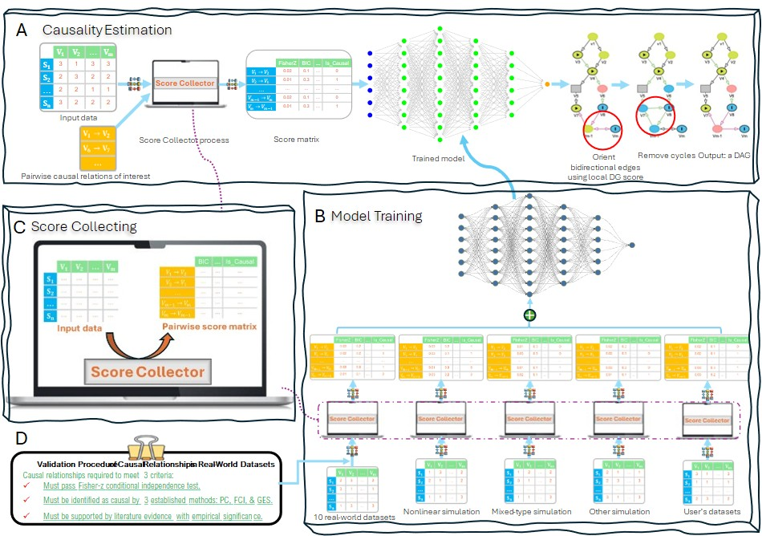
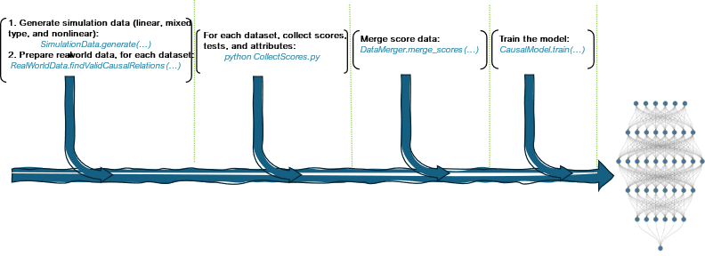
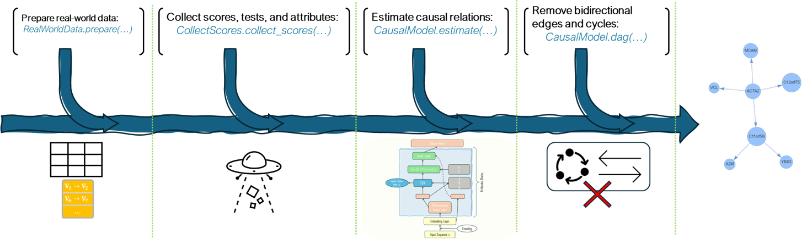

<!-- Improved compatibility of back to top link: See: https://github.com/othneildrew/Best-README-Template/pull/73 -->
<a id="readme-top"></a>
<!--
*** Thanks for checking out the Best-README-Template. If you have a suggestion
*** that would make this better, please fork the repo and create a pull request
*** or simply open an issue with the tag "enhancement".
*** Don't forget to give the project a star!
*** Thanks again! Now go create something AMAZING! :D
-->


<!-- PROJECT SHIELDS -->
<!--
*** I'm using markdown "reference style" links for readability.
*** Reference links are enclosed in brackets [ ] instead of parentheses ( ).
*** See the bottom of this document for the declaration of the reference variables
*** for contributors-url, forks-url, etc. This is an optional, concise syntax you may use.
*** https://www.markdownguide.org/basic-syntax/#reference-style-links
-->
[![Contributors][contributors-shield]][contributors-url]
[![Forks][forks-shield]][forks-url]
[![Stargazers][stars-shield]][stars-url]
[![Issues][issues-shield]][issues-url]
[![Unlicense License][license-shield]][license-url]
[![LinkedIn][linkedin-shield]][linkedin-url]


<!-- PROJECT LOGO -->
<br />
<div align="center">
  <a href="https://github.com/othneildrew/Best-README-Template">
    
  </a>

  <h3 align="center">Han Lab Cuasal Project Name</h3>

  <p align="center">
    An awesome README template to jumpstart your projects!
    <br />
    <a href="https://github.com/othneildrew/Best-README-Template"><strong>Explore the docs »</strong></a>
    <br />
    <br />
    <a href="https://github.com/othneildrew/Best-README-Template">View Demo</a>
    &middot;
    <a href="https://github.com/othneildrew/Best-README-Template/issues/new?labels=bug&template=bug-report---.md">Report Bug</a>
    &middot;
    <a href="https://github.com/othneildrew/Best-README-Template/issues/new?labels=enhancement&template=feature-request---.md">Request Feature</a>
  </p>
</div>


<!-- TABLE OF CONTENTS -->
<details>
  <summary>Table of Contents</summary>
  <ol>
    <li>
      <a href="#about-the-project">About The Project</a>
      <ul>
        <li><a href="#built-with">Built With</a></li>
      </ul>
    </li>
    <li>
      <a href="#getting-started">Getting Started</a>
      <ul>
        <li><a href="#prerequisites">Prerequisites</a></li>
        <li><a href="#installation">Installation</a></li>
      </ul>
    </li>
    <li><a href="#usage">Usage</a></li>
    <li><a href="#roadmap">Roadmap</a></li>
    <li><a href="#contributing">Contributing</a></li>
    <li><a href="#license">License</a></li>
    <li><a href="#contact">Contact</a></li>
    <li><a href="#acknowledgments">Acknowledgments</a></li>
  </ol>
</details>


<!-- ABOUT THE PROJECT -->
## About The Project
<br>
<div align="center">
  
</div>

Causal relationship identification is a fundamental and complex research challenge that spans multiple disciplines, including biology, epidemiology, economics, and philosophy. Various scoring techniques and independence tests, such as local scores (e.g., Degenerate Gaussian and Bayesian Information Criterion) and independence tests (e.g., Fisher's Z), have been employed in causality estimation. However, these local scores often excel in specific data types or application areas but falter in others, limiting their ability to capture the complexity and heterogeneity of underlying causal mechanisms. For instance, a method may perform well on linear relationships or continuous variables but struggle with discrete variables or non-linear relationships.
Real-world observational datasets, particularly those generated in complex biological systems, often contain diverse data types and relationships, making it essential to develop a more comprehensive approach. To address this challenge, we propose a novel causal estimation framework that leverages the powerful classification capabilities of deep neural networks to identify causal patterns in pairwise relationships. Our framework integrates multiple local causality estimation scores, independence tests, and variable attributes, allowing it to capture a wide range of causal mechanisms.
To ensure the framework's robustness and generalizability, we incorporate a diverse range of simulation data and 10 curated real-world datasets into the training procedure. Furthermore, our framework is designed to be extensible, enabling users to easily integrate their own data and additional scores and tests. Our validation results demonstrate that our framework outperforms existing methods in terms of estimation accuracy and precision on both simulation data and real-world biological datasets. By providing a more comprehensive and adaptable approach to causal relationship identification, our framework has the potential to advance research in various fields and improve our understanding of complex biological systems.


<p align="right">(<a href="#readme-top">back to top</a>)</p>


### Built With

The following is a list of frameworks/libraries used in this project.

* [![Next][Next.js]][Next-url]
* [![React][React.js]][React-url]
* [![Vue][Vue.js]][Vue-url]
* [![Angular][Angular.io]][Angular-url]
* [![Svelte][Svelte.dev]][Svelte-url]
* [![Laravel][Laravel.com]][Laravel-url]
* [![Bootstrap][Bootstrap.com]][Bootstrap-url]
* [![JQuery][JQuery.com]][JQuery-url]

<p align="right">(<a href="#readme-top">back to top</a>)</p>


<!-- GETTING STARTED -->
## Getting Started

The following is an example of how to install XXX, generate a variety of simulation data types, collect causal score & tests, train the model, and run causal estimation.
To get a local copy up and running follow these simple example steps.

### Prerequisites

This is an example of how to list things you need to use the software and how to install them.
* npm
  ```sh
  npm install npm@latest -g
  ```

### Installation

_Below is an example of how you can instruct your audience on installing and setting up your app. This template doesn't rely on any external dependencies or services._

1. Get a free API Key at [https://example.com](https://example.com)
2. Clone the repo
   ```sh
   git clone https://github.com/ZhenjiangFan/CausalFrame.git
   ```
3. Install NPM packages
   ```sh
   npm install
   ```
4. Enter your API in `config.js`
   ```js
   const API_KEY = 'ENTER YOUR API';
   ```
5. Change git remote url to avoid accidental pushes to base project
   ```sh
   git remote set-url origin github_username/repo_name
   git remote -v # confirm the changes
   ```

<p align="right">(<a href="#readme-top">back to top</a>)</p>


<!-- USAGE EXAMPLES -->

## Model training
If you would like to use your data to train the model, please follow the steps in the diagram.
<br>
<div align="center">
  
</div>

### Generate simulation data

1. Generate linear, mixed-type, and nonlinear data using the following function:
  ```py
  SimulationData.generate(…)
  ```

2. For each dataset, collect scores, tests, and attributes using the following function:
  ```sh
  python CollectScores.py --file_path [file path to the input data matrix file] --input_file [the input data matrix file] --graph_file [the graph file containing truth causal edges]
  # The following is an example. Please note that the argument "--graph_file" is optional.
  python CollectScores.py --file_path SimulationData/Mixed/ --input_file mixed_sim_data.csv --graph_file mixed_sim_graph_edges.csv
  ```
  The output file is a data table, named "score_test_result.csv", containing score data, where the columns represent scores, tests, and relation attributes. If the graph file is provided, then this output file would contain one more column called "Label", which indicates if a row or relation is a true causal relation or not.
  <br/><br/>
3. After collecting score data for your data, the next step is to merge the newly generated score data using the following function:
  ```py
  DataMerger.merge_scores(…)
  ```
4. After merging the score data, the next step is to train the model using the following function:
  ```py
  CausalModel.train(…)
  ```

<p align="right">(<a href="#readme-top">back to top</a>)</p>

## Causal estimation

The following diagram illustrates the steps of estimating causal relations from a data matrix.

<br>
<div align="center">
  
</div>

1. The first step is to prepare your data using the following function. For instance, imputing the data if there are missing values.
  ```py
  RealWorldData.prepare(…)
  ```
2. The next step is to invoke the following function to collect scores, tests, and attributes for your data:
  ```py
  CollectScores.collect_scores(…)
  ```
3. After the score data has been generated, the next step is to estimate causal relations by passing the score data to the trained model.
  ```py
  CausalModel.estimate(…)
  ```
4. Sometimes, the estimated directed graph may contain bidirectional edges or cycles. In the literature, it is required that a causal estimation method should not contain any cycles. Therefore, the next step is to remove bidirectional edges and cycles using the following function, which returns a directed acyclic graph (DAG).
  ```py
  CausalModel.dag(…)
  ```
A directed acyclic graph in the 'dot' format, which is named as "estimated_causal_graph.dot", will be saved in the same directory as the input data.


_For more examples, please refer to the [Documentation](https://example.com)_

<p align="right">(<a href="#readme-top">back to top</a>)</p>


<!-- ROADMAP -->
## Roadmap

- [x] Add Changelog
- [x] Add back to top links
- [ ] Add Additional Templates w/ Examples
- [ ] Add "components" document to easily copy & paste sections of the readme
- [ ] Multi-language Support
    - [ ] Chinese
    - [ ] Spanish

See the [open issues](https://github.com/othneildrew/Best-README-Template/issues) for a full list of proposed features (and known issues).

<p align="right">(<a href="#readme-top">back to top</a>)</p>


<!-- CONTRIBUTING -->
## Contributing

Contributions are what make the open source community such an amazing place to learn, inspire, and create. Any contributions you make are **greatly appreciated**.

If you have a suggestion that would make this better, please fork the repo and create a pull request. You can also simply open an issue with the tag "enhancement".
Don't forget to give the project a star! Thanks again!

1. Fork the Project
2. Create your Feature Branch (`git checkout -b feature/AmazingFeature`)
3. Commit your Changes (`git commit -m 'Add some AmazingFeature'`)
4. Push to the Branch (`git push origin feature/AmazingFeature`)
5. Open a Pull Request


<!-- LICENSE -->
## License

Distributed under the Unlicense License. See `LICENSE.txt` for more information.

<p align="right">(<a href="#readme-top">back to top</a>)</p>


<!-- CONTACT -->
## Contact
<!-- [@your_twitter](https://twitter.com/your_username) - -->
Zhenjiang Fan - fanzhenjiang00@gmail.com

Project Link: [https://github.com/your_username/repo_name](https://github.com/your_username/repo_name)

<p align="right">(<a href="#readme-top">back to top</a>)</p>


<!-- ACKNOWLEDGMENTS -->
## Acknowledgments

Use this space to list resources you find helpful and would like to give credit to. I've included a few of my favorites to kick things off!

* [Choose an Open Source License](https://choosealicense.com)
* [GitHub Emoji Cheat Sheet](https://www.webpagefx.com/tools/emoji-cheat-sheet)
* [Malven's Flexbox Cheatsheet](https://flexbox.malven.co/)
* [Malven's Grid Cheatsheet](https://grid.malven.co/)
* [Img Shields](https://shields.io)
* [GitHub Pages](https://pages.github.com)
* [Font Awesome](https://fontawesome.com)
* [React Icons](https://react-icons.github.io/react-icons/search)

<p align="right">(<a href="#readme-top">back to top</a>)</p>


<!-- MARKDOWN LINKS & IMAGES -->
<!-- https://www.markdownguide.org/basic-syntax/#reference-style-links -->
[contributors-shield]: https://img.shields.io/github/contributors/othneildrew/Best-README-Template.svg?style=for-the-badge
[contributors-url]: https://github.com/othneildrew/Best-README-Template/graphs/contributors
[forks-shield]: https://img.shields.io/github/forks/othneildrew/Best-README-Template.svg?style=for-the-badge
[forks-url]: https://github.com/othneildrew/Best-README-Template/network/members
[stars-shield]: https://img.shields.io/github/stars/othneildrew/Best-README-Template.svg?style=for-the-badge
[stars-url]: https://github.com/othneildrew/Best-README-Template/stargazers
[issues-shield]: https://img.shields.io/github/issues/othneildrew/Best-README-Template.svg?style=for-the-badge
[issues-url]: https://github.com/othneildrew/Best-README-Template/issues
[license-shield]: https://img.shields.io/github/license/othneildrew/Best-README-Template.svg?style=for-the-badge
[license-url]: https://github.com/othneildrew/Best-README-Template/blob/master/LICENSE.txt
[linkedin-shield]: https://img.shields.io/badge/-LinkedIn-black.svg?style=for-the-badge&logo=linkedin&colorB=555
[linkedin-url]: https://linkedin.com/in/othneildrew
[product-screenshot]: images/screenshot.png
[Next.js]: https://img.shields.io/badge/next.js-000000?style=for-the-badge&logo=nextdotjs&logoColor=white
[Next-url]: https://nextjs.org/
[React.js]: https://img.shields.io/badge/React-20232A?style=for-the-badge&logo=react&logoColor=61DAFB
[React-url]: https://reactjs.org/
[Vue.js]: https://img.shields.io/badge/Vue.js-35495E?style=for-the-badge&logo=vuedotjs&logoColor=4FC08D
[Vue-url]: https://vuejs.org/
[Angular.io]: https://img.shields.io/badge/Angular-DD0031?style=for-the-badge&logo=angular&logoColor=white
[Angular-url]: https://angular.io/
[Svelte.dev]: https://img.shields.io/badge/Svelte-4A4A55?style=for-the-badge&logo=svelte&logoColor=FF3E00
[Svelte-url]: https://svelte.dev/
[Laravel.com]: https://img.shields.io/badge/Laravel-FF2D20?style=for-the-badge&logo=laravel&logoColor=white
[Laravel-url]: https://laravel.com
[Bootstrap.com]: https://img.shields.io/badge/Bootstrap-563D7C?style=for-the-badge&logo=bootstrap&logoColor=white
[Bootstrap-url]: https://getbootstrap.com
[JQuery.com]: https://img.shields.io/badge/jQuery-0769AD?style=for-the-badge&logo=jquery&logoColor=white
[JQuery-url]: https://jquery.com 
